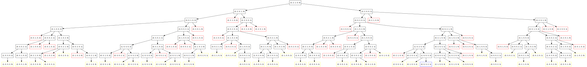
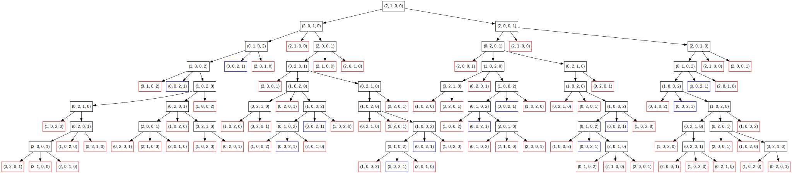

# 🧠 Torres de Hanoi con Discos Frágiles (Backtracking Visual)

Este proyecto implementa una variante del clásico problema de las **Torres de Hanoi**, incorporando discos especiales llamados **Discos Frágiles**, los cuales pueden moverse solo una cantidad limitada de veces.

A través de un algoritmo de **Backtracking**, se exploran todos los posibles movimientos válidos entre las torres, respetando las reglas clásicas del problema y las restricciones adicionales impuestas por los discos frágiles.

Cada estado generado se guarda como un nodo de un grafo dirigido, que puede visualizarse fácilmente mediante una herramienta online de Graphviz.

---

## 📌 Características del proyecto

- Algoritmo de **Backtracking** con poda de estados repetidos.
- Soporte para discos normales y **Discos Frágiles** con límite de movimientos.
- Generación de grafo en formato DOT, con visualización de estados:
  - 🔵 **Azul**: solución encontrada.
  - 🔴 **Rojo**: estado ya visitado.
  - ⚫ **Negro**: nodo explorado normalmente.
  - 🟡 **Amarillo**: nodo terminal bloqueado por restricciones de discos frágiles.

---

## 📂 Archivos principales
- `only-backtracking.py`: script principal que ejecuta el algoritmo e imprime por pantalla las soluciones encontradas.
- `graph_backtracking.py`: script que ejecuta el algoritmo y genera el archivo `.dot` con el grafo de estados.
- `hanoi_arbol_colores.dot`: archivo de salida en formato Graphviz generado automáticamente.
- `Disco` y `DiscoFragil`: clases que modelan los discos normales y los discos frágiles respectivamente.

---
Ejemplo:
  
  

Ejemplo 2:
  
---

## 🧪 Requisitos

- Python **3.13**
- No se necesitan librerías externas, todo el código utiliza únicamente la biblioteca estándar.

---

## ▶️ Cómo ejecutar

1. Cloná o descargá este repositorio.
2. Ejecutá el script principal:

```bash
python graph_backtracking.py
